<p align="center">
  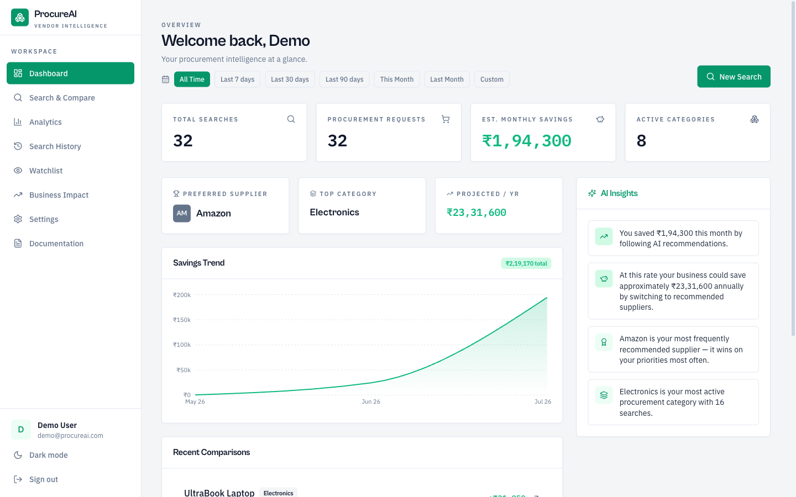
</p>

# 🚀 ProcureAI

**AI-Powered Procurement & Vendor Intelligence Platform**

### 👥 Who is ProcureAI for?

- 🏭 Manufacturers
- 🛒 Retail & D2C brands
- 📦 Supply-chain & logistics teams
- 🏢 SMEs
- 💼 Procurement & sourcing teams

> Any business that compares suppliers before purchasing can use ProcureAI.

ProcureAI helps businesses discover suppliers, compare procurement options, optimize purchasing decisions, and build long-term supplier networks — using explainable AI.

🤖 **AI Procurement Intelligence**  
💰 **Business Impact** Dashboard  
📊 **ROI Calculator**  
🏢 **Supplier Hub** — Online + Offline

### 🏆 What makes ProcureAI different?

- ✅ Compare online + offline suppliers in one search
- ✅ Build your own private supplier network
- ✅ Explainable AI recommendations with confidence scores
- ✅ 6 procurement strategies for different business goals
- ✅ AI basket optimization across all suppliers
- ✅ Business impact analytics and ROI tracking
- ✅ Procurement intelligence platform, not just price comparison

[](https://github.com/Rakshitkulkarni223/ProcureAI)

---

## 🌐 Live Demo

> Try ProcureAI right now — no setup required.

| | |
|---|---|
| **Production** | [https://buywise-compare-1.emergent.host](https://buywise-compare-1.emergent.host) |
| **Preview** | [https://buywise-compare-1.preview.emergentagent.com](https://buywise-compare-1.preview.emergentagent.com) |

### Demo Account

| Field | Value |
|---|---|
| **Email** | `demo@procureai.com` |
| **Password** | `Demo@123` |

> The demo user is auto-created on first startup via the seed script.

---

## 📸 Product Screenshots

| Dashboard | Search & Compare | AI Explanation |
|---|---|---|
|  | 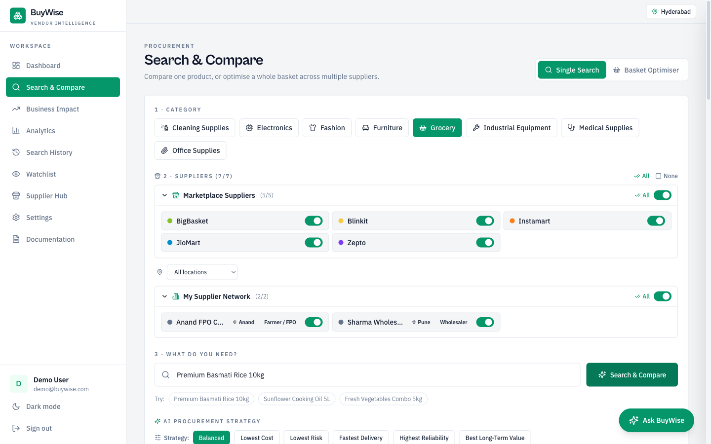 | 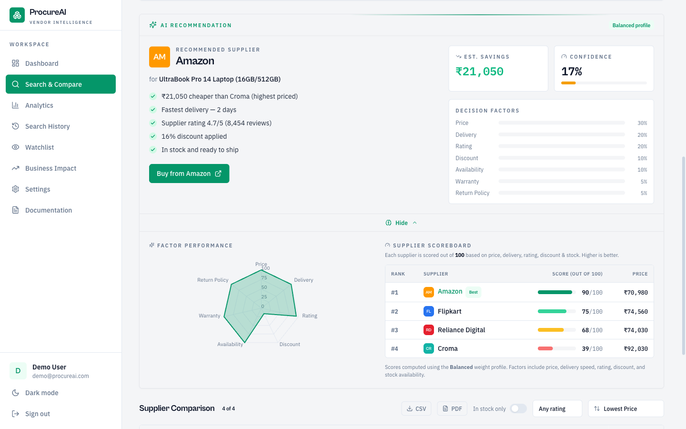 |

| Basket Optimization | Business Impact | ROI Calculator |
|---|---|---|
| 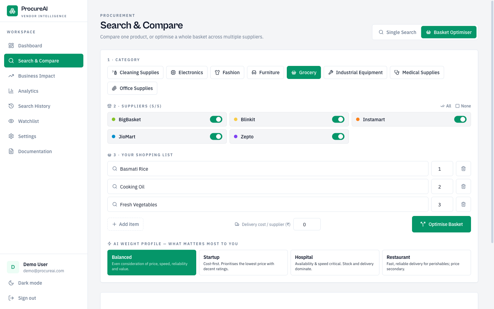 | 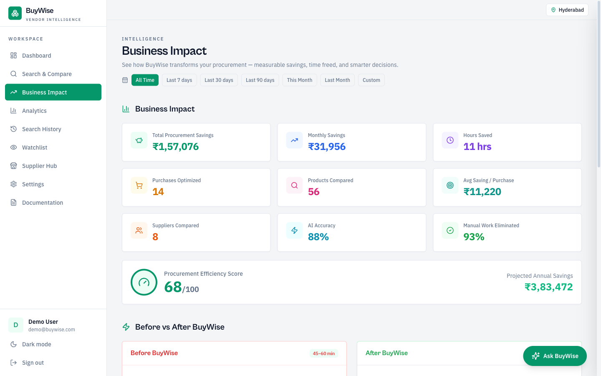 | 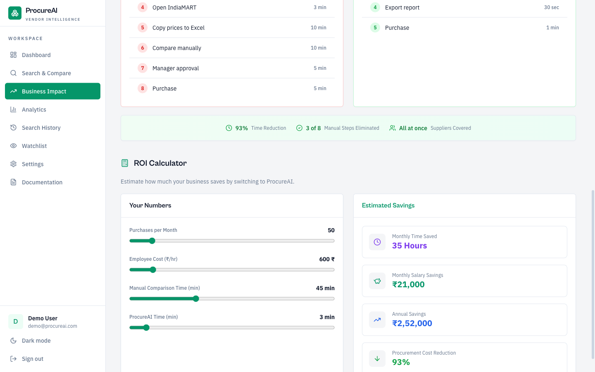 |

| Analytics | Search History | Watchlist |
|---|---|---|
| 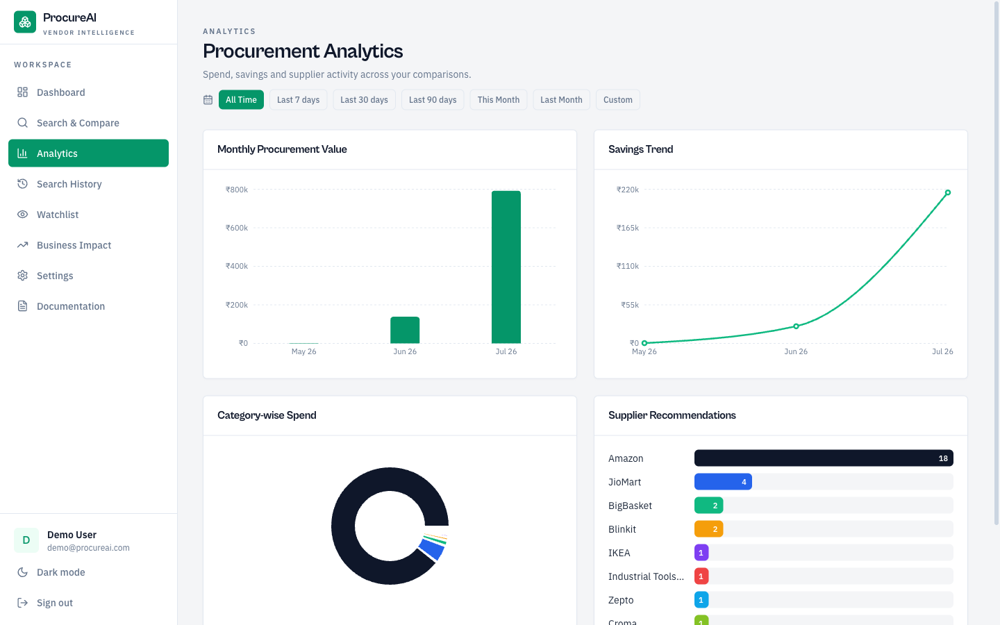 | 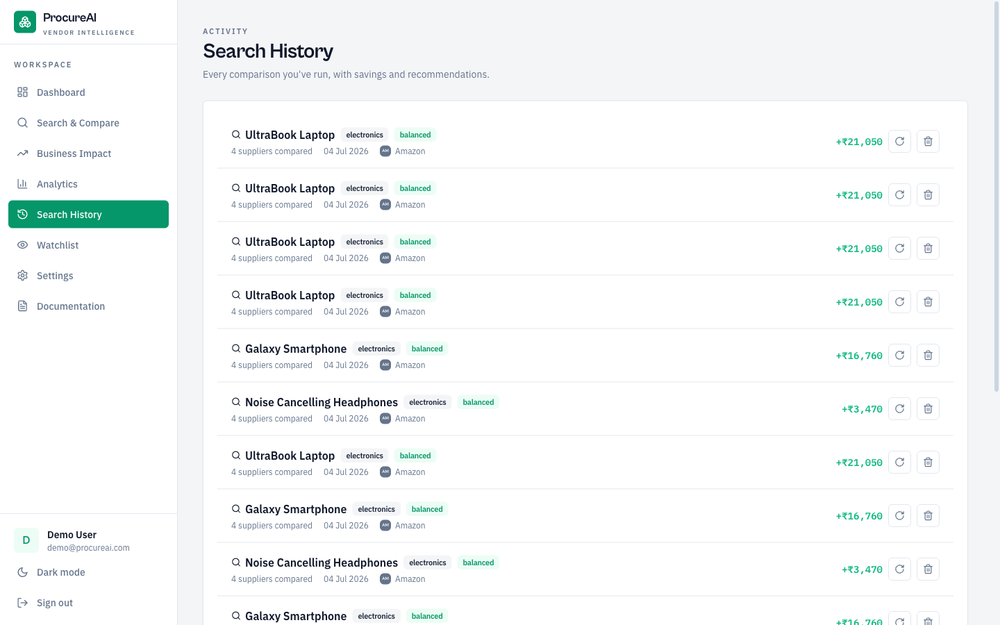 | 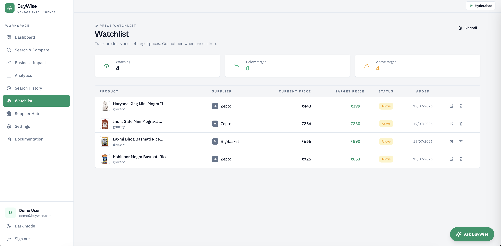 |

<details>
<summary>More screenshots — Settings & Documentation</summary>

| Settings & Weight Profiles | Built-in Documentation |
|---|---|
| 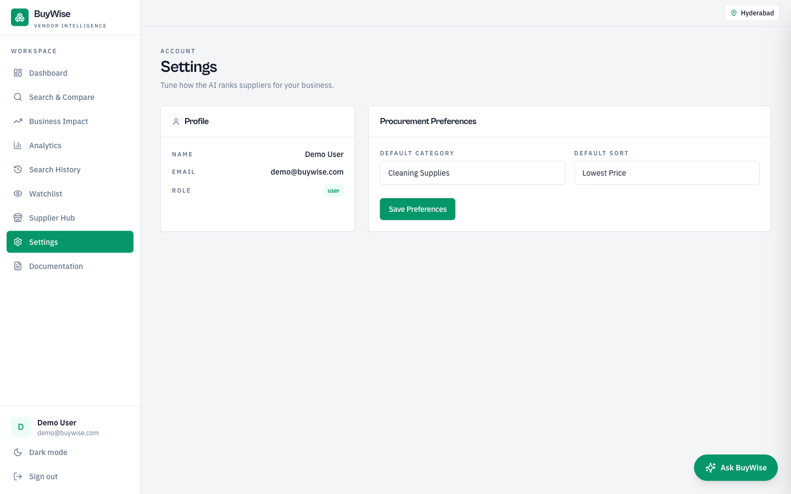 | 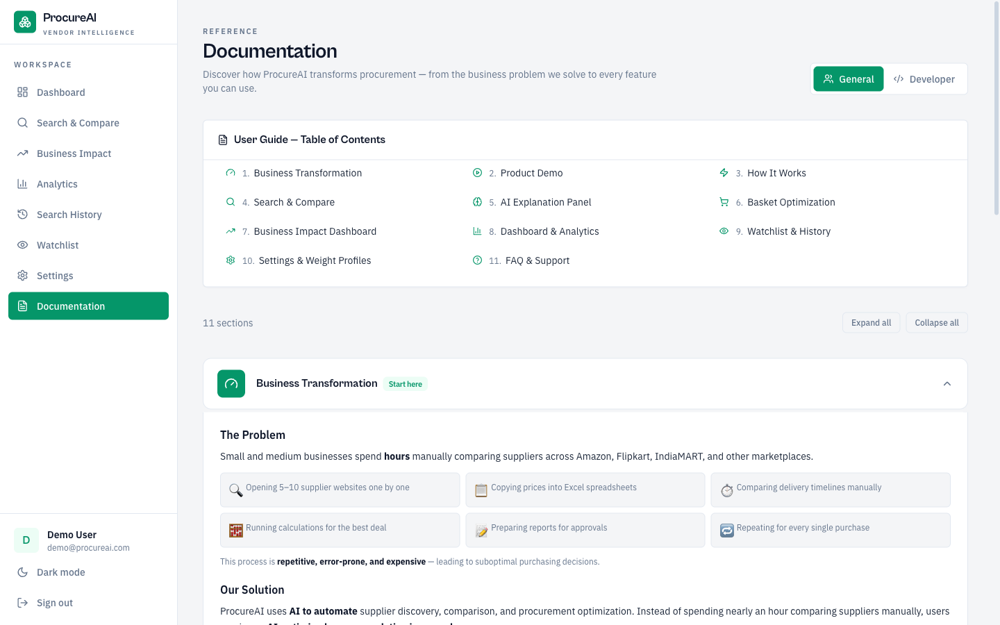 |

</details>

---

## 🎬 Product Demo

> Full walkthrough: Login → Dashboard → Business Impact → Search & Compare → Basket Optimizer → Analytics → History → Watchlist → Settings → Docs → Dark Mode

[Demo Video](https://github.com/user-attachments/assets/80705382-ff09-4438-9ee8-7c09f00f426b)

<details>
<summary>Can't see the video? Click to expand.</summary>

Download from [`demo/procureai-demo.mp4`](demo/procureai-demo.mp4) and play locally.

</details>

---

## 🧠 Procurement Intelligence

ProcureAI is more than a supplier comparison tool. It acts as an **AI procurement analyst** that helps businesses answer questions like:

- Which supplier offers the best long-term value?
- Should I split my basket across suppliers?
- Is paying more worth faster delivery?
- Which suppliers are becoming risky?
- How much money and time can I save every month?

Instead of comparing prices alone, ProcureAI combines **procurement intelligence**, **supplier intelligence**, and **explainable AI** to recommend the best purchasing strategy.

---

## 🏆 Real Business Impact

### The Problem

Businesses spend **45–60 minutes** manually comparing suppliers across multiple marketplaces, maintaining spreadsheets, and making procurement decisions with limited visibility.

### The Solution

ProcureAI uses **AI to compare suppliers, optimize purchasing decisions, and recommend the best procurement strategy in seconds** — with full transparency into why each supplier was chosen.

### Before vs After

| | Before (Manual) | After (ProcureAI) |
|---|---|---|
| **Supplier comparison** | Manual across 5–10 websites | Automated — all suppliers in one click |
| **Time per procurement** | 45–60 minutes | 3–5 minutes |
| **Calculations** | Excel / paper | Eliminated — AI handles scoring |
| **AI recommendations** | ❌ Not available | ✅ Weighted scoring with explanation |
| **Reports** | Manual preparation | One-click CSV & PDF export |
| **Multi-item optimization** | Not feasible | ✅ Split-cart optimizer across suppliers |
| **Savings tracking** | No visibility | ✅ Real-time dashboard with trends |
| **Decision transparency** | "Gut feel" | ✅ Radar chart + scoreboard |

---

## 🔍 Why ProcureAI? (Not Another Marketplace)

ProcureAI is **not another marketplace**. Marketplaces sell products from their own ecosystem. ProcureAI helps businesses make the **best procurement decision** across all suppliers — online and offline.

| | Marketplaces (Udaan, Amazon) | Traditional Comparison | ProcureAI |
|---|---|---|---|
| **Supplier scope** | Their own sellers only | One website at a time | All suppliers in one click |
| **Offline suppliers** | ❌ Not supported | ❌ Not supported | ✅ Your own supplier network |
| **Decision logic** | Cheapest product | Sort by price/rating | Best business decision (7 factors) |
| **AI reasoning** | ❌ None | ❌ None | ✅ Explainable AI + confidence score |
| **Multi-item buying** | Manual | Manual | ✅ AI Basket Optimizer |
| **Analytics** | ❌ None | ❌ None | ✅ Business Impact + ROI Calculator |
| **Supplier network** | ❌ Locked to platform | ❌ No custom suppliers | ✅ Build your private network |
| **Location intelligence** | ❌ None | ❌ None | ✅ City/state-aware delivery |

> Instead of replacing supplier relationships, **ProcureAI makes every supplier intelligent**.

---

## ✨ Key Features

| Feature | Description |
|---|---|
| **Single Product Search** | Search any product across all configured suppliers in one click. Results are normalized and ranked by an AI recommendation engine. |
| **Basket Optimization** | Add multiple items to a basket. The split-cart optimizer finds the cheapest combination across suppliers while factoring in consolidation penalties (shipping). |
| **Supplier Comparison Dropdown** | Item-by-item supplier comparison in basket results via a responsive dropdown — view pricing, location, delivery, and ratings per item without UI clutter. |
| **Location-Aware Delivery** | Set your city in Settings. Delivery estimates auto-calculate: same city → 1 day, same state → 2 days, different state → 4–5 days. Supplier Hub filters to your state. |
| **AI Explanation Panel** | "Why this recommendation?" — interactive radar chart comparing top suppliers + color-coded scoreboard with scores out of 100. |
| **Export Reports** | Export comparison results to CSV or styled PDF directly from the results table. |
| **Price Watchlist** | Add products to a persistent watchlist to track prices and set target alerts across sessions. |
| **Business Impact Dashboard** | Total savings, hours saved, purchases optimized, AI accuracy, procurement efficiency score, projected annual savings — all with date range filtering. |
| **Before vs After Workflow** | Visual side-by-side comparison of manual procurement (45–60 min, 8 steps) vs ProcureAI-assisted (3–5 min, 5 steps). |
| **ROI Calculator** | Interactive calculator with sliders — estimate monthly hours saved, salary savings, annual savings, and cost reduction %. |
| **Dashboard & Analytics** | Real-time KPIs with date range filtering — preset ranges (Last 7/30/90 days, This Month, Last Month) or custom date picker. |
| **Search History** | Paginated per-user log of comparisons with basket entries tagged. Failed/empty searches are excluded. |
| **Dark Mode** | Full light/dark theme support with CSS variable theming. |

---

## 🏢 Supplier Hub — Your Private Supplier Network

Businesses already have trusted suppliers. ProcureAI allows users to **create their own private procurement network** by combining online marketplaces with offline suppliers.

**Combine:**

| Online Marketplaces | Your Offline Suppliers |
|---|---|
| Amazon Business | Your Rice Mill |
| Udaan | Vegetable Vendor |
| Metro | Oil Distributor |
| IndiaMART | Local Mandi |

Every supplier — online or offline — becomes searchable and comparable using the same AI recommendation engine.

| Capability | Description |
|---|---|
| **Build Your Supplier Network** | Register your own suppliers with name, contact, city, state, and category |
| **Add Products** | Add products with pricing, delivery days, warranty, ratings, and stock status |
| **Unified Search** | Supplier Hub products appear alongside marketplace results in every search |
| **State Filtering** | Only suppliers from your state are included — ensuring relevant, local results |
| **Same AI Engine** | Your suppliers are scored and ranked by the same recommendation engine as marketplace suppliers |

| Supplier List | Supplier Products |
|---|---|
|  |  |

---

## 🤖 AI Procurement Intelligence (Explainable AI)

ProcureAI uses **Explainable AI** to evaluate procurement decisions using a multi-factor scoring engine. It doesn't simply rank the cheapest supplier — it balances cost, speed, quality, and risk to produce the best procurement recommendation.

**Users always know WHY a supplier was recommended.**

### What the AI Evaluates

| Factor | What It Measures |
|---|---|
| **Price** | Unit cost, line total, volume discounts |
| **Delivery** | Estimated days based on supplier location and user city |
| **Reliability** | Supplier rating, delivery consistency |
| **Warranty** | Coverage duration in months |
| **Returns** | Return policy availability and terms |
| **Risk** | Composite risk score (price volatility, delivery risk, supplier concentration) |
| **Total Cost** | Full procurement cost including shipping, handling, and consolidation penalties |

### What the AI Produces

- ✅ **Confidence Score** — How confident the AI is in its recommendation
- ✅ **Business Reasoning** — Why this supplier was selected (not just "lowest price")
- ✅ **Trade-offs** — Radar chart showing how the top supplier compares on every dimension
- ✅ **Supplier Scoreboard** — All suppliers ranked with scores out of 100
- ✅ **Business Impact** — Estimated savings vs. the most expensive alternative

---

## 💡 Why AI?

Traditional procurement tools rank suppliers using simple sorting — lowest price or highest rating. This leads to suboptimal decisions because procurement is inherently multi-dimensional.

| | Traditional Comparison | ProcureAI AI |
|---|---|---|
| **Decision** | Cheapest product | Best business decision |
| **Scope** | One supplier at a time | All suppliers simultaneously |
| **Method** | Manual Excel/spreadsheets | Automated multi-factor scoring |
| **Transparency** | No explanation | Explainable AI with reasoning |
| **Items** | Single item comparison | AI Basket Optimization |
| **Insights** | No analytics | Business Impact Dashboard |

ProcureAI uses a **multi-factor AI procurement engine** that balances cost, delivery, reliability, warranty, returns, risk, and business strategy — enabling procurement decisions that **align with business priorities** rather than optimizing for a single metric.

### AI Pipeline

```
User Search
    │
    ▼
┌─────────────────────────────────────┐
│  Marketplace Results + Supplier Hub  │
└──────────────────┬──────────────────┘
                   ▼
┌─────────────────────────────────────┐
│  Normalization & Scoring             │
└──────────────────┬──────────────────┘
                   ▼
┌─────────────────────────────────────┐
│  Recommendation Engine (6 modes)     │
└──────────────────┬──────────────────┘
                   ▼
┌─────────────────────────────────────┐
│  Explainable AI (reasoning + chart)  │
└──────────────────┬──────────────────┘
                   ▼
┌─────────────────────────────────────┐
│  Recommendation + Business Impact    │
└─────────────────────────────────────┘
```

---

## 🎯 Procurement Strategies (Recommendation Modes)

The same supplier may not be the best choice under every business objective. ProcureAI supports **6 recommendation modes** that rerank suppliers based on what matters most to your business.

| Mode | Optimizes For | Best When |
|---|---|---|
| **Balanced** | Weighted score across all factors | Default — general-purpose procurement |
| **Lowest Cost** | Total procurement cost (price + shipping + handling) | Budget is the primary constraint |
| **Lowest Risk** | Composite risk score (price stability, delivery risk) | Buying critical or high-value items |
| **Fastest Delivery** | Minimum delivery days | Urgent or time-sensitive purchases |
| **Highest Reliability** | Supplier delivery consistency and rating | Repeat orders where reliability matters |
| **Best Long-Term Value** | Supplier score (quality + consistency + warranty) | Building long-term supplier relationships |

Different business goals produce different recommendations. The recommendation engine **dynamically reranks suppliers** without changing the underlying supplier data — the same product catalog produces different "best" suppliers depending on what your business prioritizes.

> Each mode generates **different business-friendly reasoning** explaining why the recommended supplier was chosen under that specific strategy.

---

## 🔄 Procurement Workflow

```
     ┌───────────────────┐     ┌───────────────────────┐
     │  Supplier Network  │     │  Marketplace Suppliers │
     │  (Your Suppliers)  │     │  (Amazon, Udaan, etc.) │
     └────────┬──────────┘     └───────────┬───────────┘
              └──────────────┬─────────────┘
                             ▼
              ┌──────────────────────────┐
              │   AI Procurement Engine  │
              │  (Multi-factor scoring)  │
              └────────────┬─────────────┘
                           ▼
              ┌──────────────────────────┐
              │  Recommendation + Explain│
              └────────────┬─────────────┘
                           ▼
              ┌──────────────────────────┐
              │   Basket Optimization    │
              └────────────┬─────────────┘
                           ▼
              ┌──────────────────────────┐
              │  Business Impact + Export│
              └──────────────────────────┘
```

1. **Build** — Add your trusted suppliers and products to Supplier Hub
2. **Search** — Type a product name, pick a category — ProcureAI queries marketplaces + your suppliers simultaneously
3. **Compare** — Results from online and offline suppliers are normalized in one sortable table
4. **Recommend** — AI scores every option across price, delivery, reliability, risk, warranty, and returns
5. **Explain** — Click "Why this recommendation?" for a radar chart, scoreboard, and business reasoning
6. **Optimize** — Add multiple items to a basket for split-cart optimization across all suppliers
7. **Export** — Download results as CSV or styled PDF for team review
8. **Track** — Monitor savings, hours freed, and procurement efficiency on the Business Impact dashboard

---

## ️ Architecture

### Technology Stack

| Layer | Technology |
|---|---|
| **Frontend** | React 18, TypeScript, TailwindCSS, React Router v6, Axios, Recharts, Framer Motion, Lucide Icons |
| **Backend** | Python 3.13, FastAPI, Pydantic (validation), Uvicorn |
| **Database** | MongoDB with Motor (async driver) |
| **Auth** | JWT (PyJWT) + bcrypt |

### High-Level Architecture

```
┌──────────────────────────────────────────────────────────────────┐
│                        Browser (React SPA)                       │
│  ┌──────────┐ ┌──────────┐ ┌───────────┐ ┌──────────┐           │
│  │Dashboard │ │ Search & │ │ Supplier  │ │ Business │           │
│  │          │ │ Compare  │ │   Hub     │ │  Impact  │           │
│  └────┬─────┘ └────┬─────┘ └─────┬─────┘ └────┬─────┘           │
│       └─────────────┴─────────────┴─────────────┘                │
│                           │  Axios API Client                    │
└───────────────────────────┼──────────────────────────────────────┘
                            │ HTTP / JSON
┌───────────────────────────┼──────────────────────────────────────┐
│                    FastAPI Backend (Python)                       │
│                                                                  │
│  ┌─────────┐  ┌────────────────────────────────────────────────┐ │
│  │  Auth   │  │            Search & Comparison                 │ │
│  │  (JWT)  │  │  ┌──────────────┐     ┌─────────────────────┐  │ │
│  └────┬────┘  │  │ Marketplace  │     │   Supplier Hub      │  │ │
│       │       │  │  Adapters    │     │  (Your Suppliers)   │  │ │
│       │       │  └──────┬───────┘     └─────────┬───────────┘  │ │
│       │       │         └───────────┬───────────┘              │ │
│       │       │                     ▼                          │ │
│       │       │        ┌────────────────────────┐              │ │
│       │       │        │  AI Procurement        │              │ │
│       │       │        │  Engine (6 modes)      │              │ │
│       │       │        └────────────┬───────────┘              │ │
│       │       └─────────────────────┼──────────────────────────┘ │
│       │                             ▼                            │
│       │                ┌────────────────────────┐                │
│       │                │   Basket Optimizer     │                │
│       │                │   (Split-Cart AI)      │                │
│       │                └────────────┬───────────┘                │
│  ┌────┴─────────────────────────────┴────────────────────────┐   │
│  │              Services (Motor async MongoDB)               │   │
│  └──────────────────────────┬────────────────────────────────┘   │
└─────────────────────────────┼────────────────────────────────────┘
                              │
                      ┌───────┴───────┐
                      │   MongoDB     │
                      │  (Atlas /     │
                      │   Local)      │
                      └───────────────┘
```

---

## 📡 API Reference

### Authentication

| Method | Endpoint | Description |
|---|---|---|
| POST | `/api/auth/register` | Register a new user |
| POST | `/api/auth/login` | Login, returns JWT token |
| GET | `/api/auth/me` | Get current user profile |

### Search & Compare

| Method | Endpoint | Description |
|---|---|---|
| POST | `/api/search` | Search products across suppliers |
| GET | `/api/categories` | List all product categories |
| GET | `/api/suppliers/:category` | List suppliers for a category |

### Basket Optimization

| Method | Endpoint | Description |
|---|---|---|
| POST | `/api/basket/optimize` | Optimize a multi-item basket |
| GET | `/api/basket/history?page=1&limit=20` | Paginated basket optimization history |

### Supplier Hub

| Method | Endpoint | Description |
|---|---|---|
| GET | `/api/suppliers` | List all your suppliers |
| POST | `/api/suppliers` | Add a new supplier |
| GET | `/api/suppliers/:id` | Get supplier details |
| PUT | `/api/suppliers/:id` | Update a supplier |
| DELETE | `/api/suppliers/:id` | Remove a supplier |
| GET | `/api/suppliers/:id/products` | List products for a supplier |
| POST | `/api/suppliers/:id/products` | Add a product to a supplier |
| PUT | `/api/suppliers/:id/products/:pid` | Update a product |
| DELETE | `/api/suppliers/:id/products/:pid` | Remove a product |

### History & Preferences

| Method | Endpoint | Description |
|---|---|---|
| GET | `/api/history?page=1&limit=20` | Paginated search history |
| DELETE | `/api/history/:id` | Delete a history entry |
| GET | `/api/preferences` | Get user preferences (includes city) |
| PUT | `/api/preferences` | Update user preferences (city, category, weight profile) |
| GET | `/api/cities` | List available cities for location preference |

### Dashboard, Analytics & Business Impact

| Method | Endpoint | Description |
|---|---|---|
| GET | `/api/dashboard?from=&to=` | Dashboard KPIs (date range optional) |
| GET | `/api/analytics/spend?from=&to=` | Spend analytics |
| GET | `/api/analytics/savings?from=&to=` | Savings trend |
| GET | `/api/insights?from=&to=` | AI-generated procurement insights |
| GET | `/api/business-impact?from=&to=` | Business impact metrics (savings, hours saved, efficiency, ROI) |

---

## 🚀 Setup & Running

### Prerequisites

- **Python** >= 3.11
- **Node.js** >= 18.x (frontend only)
- **MongoDB** (local or Atlas connection string)

### 1. Clone the Repository

```bash
git clone https://github.com/Rakshitkulkarni223/ProcureAI.git
cd ProcureAI
```

### 2. Backend Setup

```bash
cd backend
pip install -r requirements.txt
```

Create a `.env` file in `backend/`:

```env
MONGO_URL=mongodb+srv://<user>:<pass>@cluster.mongodb.net
DB_NAME=procureai
JWT_SECRET=your-secret-key
JWT_EXPIRES_IN=7d
PORT=8001
DEMO_EMAIL=demo@procureai.com
DEMO_PASSWORD=Demo@123
DEMO_NAME=Demo User
CORS_ORIGINS=*
```

Start the backend:

```bash
uvicorn server:app --host 0.0.0.0 --port 8001 --reload   # Development
uvicorn server:app --host 0.0.0.0 --port 8001             # Production
```

### 3. Frontend Setup

```bash
cd frontend
npm install
```

Create a `.env` file in `frontend/`:

```env
REACT_APP_BACKEND_URL=http://localhost:8001
```

Start the frontend:

```bash
npm start
```

---

## 🛠️ Developer Guide

### Project Structure

```
ProcureAI/
├── backend/
│   ├── server.py               # FastAPI entry point (Uvicorn)
│   ├── requirements.txt        # Python dependencies
│   └── app/
│       ├── config.py           # Env vars, categories, suppliers, weight profiles, city/state mapping
│       ├── database.py         # Motor async MongoDB client
│       ├── auth.py             # JWT (PyJWT), bcrypt password hashing, auth dependency
│       ├── schemas.py          # Pydantic validation models (SearchInput, BasketInput, PreferenceInput)
│       ├── routes.py           # All API routes under /api prefix
│       ├── routes_supplier.py  # Supplier Hub CRUD routes
│       ├── schemas_supplier.py # Supplier Hub Pydantic models
│       ├── seed.py             # DB seeder (categories, suppliers, demo user, sample history)
│       └── services/
│           ├── core.py         # PRNG, CatalogResolver, MockProviderAdapter, Search, Recommendation
│           ├── basket.py       # Basket optimization (split-cart)
│           ├── analytics.py    # Dashboard, History, Preference, Catalog services
│           ├── supplier_hub.py # Supplier Hub CRUD service
│           ├── supplier_hub_adapter.py  # Adapter for Supplier Hub as a provider
│           └── supplier_hub_search.py   # Supplier Hub search with state-based filtering
│
├── frontend/
│   └── src/
│       ├── components/         # Reusable UI (AppLayout, Card, Badge, DateRangeFilter, BasketResults, etc.)
│       ├── context/            # AuthContext, ThemeContext, LocationContext
│       ├── hooks/              # useSearchSuggestions, useWatchlist
│       ├── lib/                # api client, formatters, exportUtils
│       ├── pages/              # Dashboard, Search, BusinessImpact, Analytics, History, Watchlist, Settings, Docs
│       └── types.ts            # Shared TypeScript interfaces
│
├── screenshots/               # Product screenshots for README
└── README.md
```

### Design Decisions

- **Adapter Pattern** — Supplier integrations use an adapter interface so mock data can be swapped for real APIs without touching business logic. Supplier Hub uses the same adapter interface.
- **Service Layer** — All database access goes through service classes, keeping Motor queries out of routes.
- **Async concurrency** — Individual supplier failures don't block the entire search (asyncio gather with error handling).
- **Fire-and-forget history** — Search and basket history persisted asynchronously. Basket optimizations count as a single search entry in the dashboard.
- **Location-aware filtering** — Supplier Hub suppliers are filtered by the user's state. Delivery days estimated from city/state distance.
- **Date range filtering** — Dashboard, Analytics, and Business Impact endpoints accept optional `from`/`to` query params.
- **Business impact metrics** — Derived from search history: hours saved (manual 45 min vs AI 3 min), efficiency score (composite of accuracy + automation + volume), projected annual savings.
- **Weight profiles** — The recommendation engine is fully configurable via weight profiles and 6 recommendation modes.

### Conventions

- **Backend**: FastAPI routes → Service layer → MongoDB (Motor). All functions wrapped in try-catch. Responses use `{"success": true, "data": ...}`.
- **Frontend**: Functional components with hooks. State collocated in page components. `api.ts` centralizes all HTTP calls. TailwindCSS utility classes for styling.
- **Error handling**: All functions wrapped in try-catch blocks. Backend raises `HTTPException`. Frontend uses `apiError()` helper.
- **Validation**: Pydantic models for backend request validation. TypeScript interfaces on the frontend.

### Running Tests

```bash
cd backend
python -m pytest tests/backend_test.py -v
```

---

## 🗺️ Future Ready — Live Procurement Ecosystem

| Phase | Feature | Description |
|---|---|---|
| **P1** | Real-time Marketplace APIs | Amazon Business, Udaan, Metro, IndiaMART, Flipkart — live pricing and availability |
| **P1** | Live Supplier Quotes | Real-time quote requests and responses from Supplier Hub network |
| **P1** | ERP Integration | Sync procurement data with SAP, Oracle, Zoho for seamless order management |
| **P1** | WhatsApp Quote Reader | Send and receive supplier quotes via WhatsApp Business API |
| **P2** | Invoice OCR | Extract pricing from supplier invoices and PDFs automatically |
| **P2** | AI Negotiation | AI-assisted price negotiation based on market data and supplier history |
| **P2** | Approval Workflows | Multi-level purchase approval chains with role-based routing |
| **P2** | Predictive Procurement | ML-based demand forecasting and optimal reorder point suggestions |
| **P3** | Inventory Synchronization | Real-time stock level monitoring across warehouses and suppliers |
| **P3** | Supplier Scorecards | Historical performance tracking — on-time delivery, quality, SLA compliance |
| **Future** | Multi-currency Support | Cross-border procurement with automatic currency conversion |
| **Future** | Mobile App | React Native companion for on-the-go procurement approvals |

---

## 📈 Business Outcomes

| Outcome | How ProcureAI Delivers It |
|---|---|
| **Reduce procurement costs** | AI finds the best price-to-value ratio, not just the cheapest product |
| **Save procurement time** | 45–60 min manual process → 3–5 min with AI |
| **Improve supplier selection** | Multi-factor scoring across 7 dimensions |
| **Reduce operational risk** | Risk scoring identifies unreliable suppliers before purchase |
| **Increase purchasing transparency** | Explainable AI with confidence scores and reasoning |
| **Track ROI** | Business Impact Dashboard with savings trends and efficiency scores |
| **Build supplier intelligence** | Supplier Hub creates a private, reusable procurement network |

---

## 🏅 Competitive Advantages

- ✅ **Marketplace Comparison** — All suppliers in one click
- ✅ **Private Supplier Network** — Online + Offline suppliers combined
- ✅ **Explainable AI** — Confidence score + radar chart + business reasoning
- ✅ **6 Procurement Strategies** — Dynamically rerank without changing data
- ✅ **AI Basket Optimization** — Split-cart across all suppliers
- ✅ **Business Impact Analytics** — Savings, hours saved, efficiency score
- ✅ **ROI Calculator** — Estimate monthly and annual procurement savings
- ✅ **Procurement Intelligence** — Multi-factor scoring, not just price
- ✅ **Location-Aware Delivery** — City/state-based delivery estimation
- ✅ **Future Ready** — Designed for real-time APIs, WhatsApp, OCR, ERP

---

<p align="center">
  <b>ProcureAI</b> — Transforming procurement from comparing prices to making intelligent business decisions.<br/>
  <a href="https://github.com/Rakshitkulkarni223/ProcureAI">GitHub</a>
</p>
